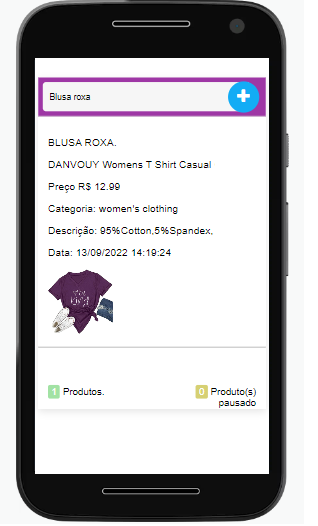
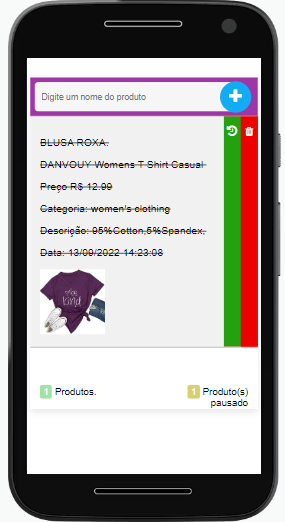
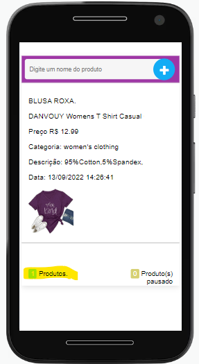
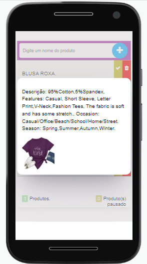

# Projeto de topicos especiais
* O que a aplicação faz.

O projeto tem como base a criação de produtos registrado na api gratuita de produtos fakes:
https://fakestoreapi.com/ Apos inserir um nome de um produto que contenha na api é registrado na lista. 

* Descrição de cada página ou tela

A tela inicial possuir um input para o usuario insere o produto, caso o produto contenha na api o mesmo é registrado, para fazer o teste abaixo contém os nomes dos produtos que contém na api.

### **Os seguintes produtos contém na api:**

Blusa Azul

Blusa vermelha

Blusa branca

Jacketa azul 

Jacketa preta

Blusa de frio roxa

Tv Sansumg

Tv Acer

HD

Sdd 256

Sdd plus

Hd portatil

Brinco

Anel

Pulseira 

Cordao

Blusa Manga longa

Blusa Manga longa Marron

Blusa

Ao clickar na imagem do produto é mostrado as opções de pausar o produto ou deletar o produto.

Possuir um contador do produto no rodapé da imagem, informando produtos pausados e produtos registrados, para refazer a contagem do produto basta clicar no número de produtos e recalcular o número de produtos. 

Ao clickar em qualquer texto é mostrado um modal com a imagem do produto com texto em evidência. 

Essa aplicação foi desenvolvido por mim em html, css e javascript puro. A aplicação possuir apenas uma tela inicial e modal para os textos do produto.

O aplicativo contém uma classe de apiFetch para realizar a buscar do produto na api.
~~~javascript
    //Aqui vou consumir api para buscar imagens e descrição do produto
    const apiFetch = new FetchApi();
    const api = await apiFetch.getApi(`https://fakestoreapi.com/products/${parseInt(valorCatalago)}`);

    //Salvando lista no localstorage
    
    if (listProdutosSalvos.length == 0) {
      localStorage.setItem("produtos", JSON.stringify([produtoBuscar]));
    } else {
      localStorage.setItem("produtos", JSON.stringify([...listProdutosSalvos, produtoBuscar]));
    }
~~~

A aplicação armazena e usa de forma relevante dados complexos (mais de um atributo)?

Os dados são da api, é criado dinamicamente em javascript o card das informações que são consultados da api.

A aplicação possui um manifesto para instalação no dispositivo do usuário?

Sim 

A aplicação possui um service worker que permite o funcionamento off-line?

Sim 

O código da minha aplicação possui comentários explicando cada operação?

Sim 

A aplicação está funcionando corretamente?

Sim 

A aplicação está completa?

Sim